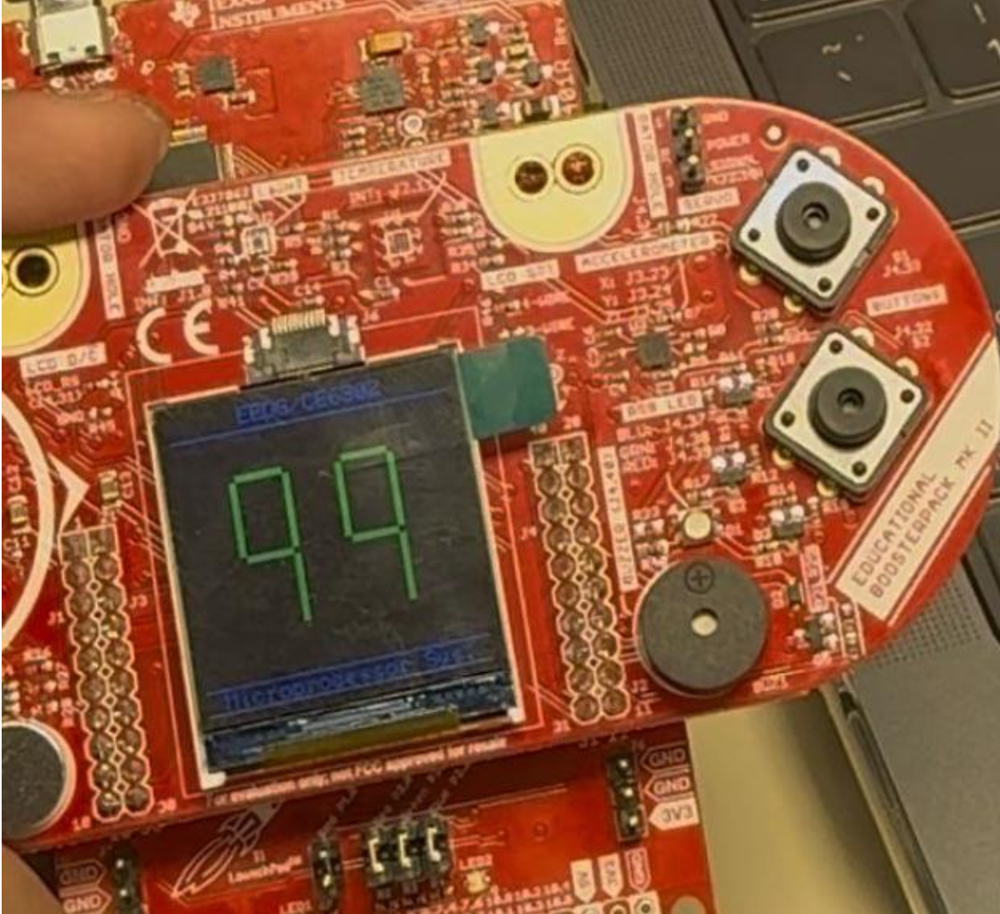

# **MSP432 Joystick to Seven-Segment Display**

## **Overview**
This project demonstrates the integration of a joystick with an MSP432P401R microcontroller to display numerical values on a seven-segment LCD. The joystick's Y-axis movement is captured using an Analog-to-Digital Converter (ADC), and the values are mapped to a range of **0-99**, which is then displayed on the LCD screen.

---

## **Hardware Requirements**
- **MSP432P401R LaunchPad**
- **Educational BoosterPack MKII**
- **Joystick**
- **LCD Screen**

---

## **Software Requirements**
- **Energia IDE**
- **MSP432 Driver Library**

---

## **Installation**
1. **Install Energia IDE**: Download and install the Energia IDE from the [official website](http://energia.nu/download/).
2. **Install MSP432 Driver Library**: Follow the instructions provided in the Energia IDE to install the necessary libraries for the MSP432 microcontroller.

---

## **Code Explanation**
The code is divided into two main parts:

- **Displaying 0-9**: This part of the code reads the joystick's Y-axis input, maps the ADC value to a range of 0-9, and displays the corresponding digit on the LCD.

- **Displaying 00-99**: This part extends the functionality to display two-digit numbers by separating the tens and units digits and displaying them on the LCD.

---

## **Results**
The project successfully maps the joystick's Y-axis movement to a numerical range of 0-99 and displays the corresponding values on the LCD screen. The display updates in real-time as the joystick is moved.

